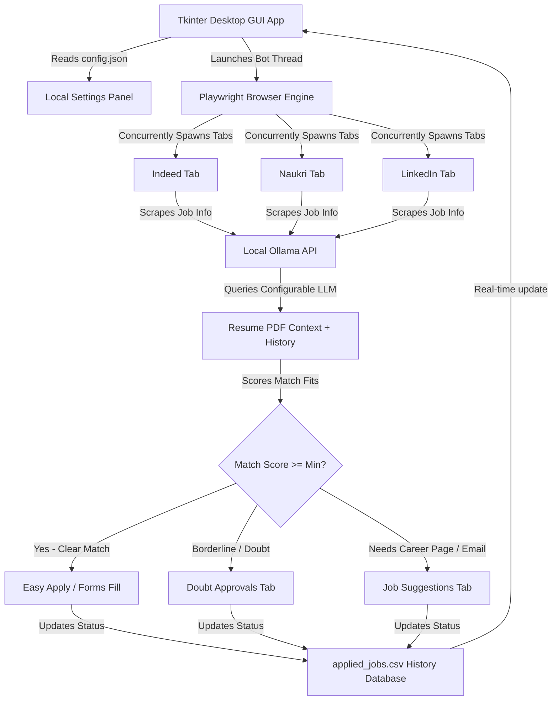

# ✦ Job AI Agent (Desktop Assistant)

[](LICENSE)
[](#installation)
[](https://ollama.com)

An advanced, stealthy desktop automation assistant that concurrently crawls major job platforms (**Indeed**, **Naukri**, and **LinkedIn**), parses your local PDF resume, evaluates fit dynamically using a **local LLM via Ollama**, and automatically helps you apply in real time!

---

## 🚀 Key Features

* **Parallel Multi-Tab Browser Automation:** Runs Chromium Playwright tabs concurrently in a unified, persistent Edge debug profile context, maintaining your browser login sessions seamlessly.
* **Local RAG & LLM Evaluation:** Interacts with a configurable local LLM via Ollama (default: `qwen2.5:7b`). It reads your raw PDF resume text, evaluates job description fits, and calculates similarity match scores dynamically. Includes automatic retry with exponential backoff.
* **Doubt Queue Approvals:** Flagged or high-salary borderline jobs are held in a manual review queue where you can read match explanations and click "Approve & Apply" or "Reject".
* **Geographic Hierarchy Selector:** Choose countries, states, and specific cities using a side-by-side hierarchical selection dropdown.
* **Tag Chip Badging Component:** Enter skills, skip keywords, and target roles block-by-block using tag chips with real-time delete buttons.
* **AI Cold Email Cover Letter Drafts:** Auto-generates customized outreach cover letters in your Suggestions tab based on your resume context, providing instant clip-board copy and `mailto:` action routing.
* **Direct SMTP Email Outreach:** Send AI-generated cover letters with resume attachment directly from the app via configured SMTP server.
* **Stealth Controls:** Utilizes automation stealth flags (`--disable-blink-features=AutomationControlled`, remote debugging ports) to avoid antibot detection scripts.
* **Configurable LLM Model:** Switch between installed Ollama models directly from the Settings GUI — auto-detects available models.
* **Dashboard Analytics:** Real-time metrics including Applications Sent, Jobs Skipped, Success Rate, and Today's session activity counters.
* **Log Search & Filtering:** Search through bot operation logs by keyword in real time.
* **Pause & Resume:** Pause the bot at any time without losing state, then resume when ready.
* **Indeed Pagination:** Automatically crawls up to 3 pages of search results per query for broader coverage.
* **Export History:** Export your full application history to CSV with one click.
* **Smart Form Polling:** Replaces fixed wait times with intelligent polling that checks for form submission completion every 3 seconds.
* **Auto-Retry:** Transient navigation failures are automatically retried with exponential backoff.

---

## 🛠️ System Architecture



---

## 📦 Installation & Setup

### 1. Prerequisites
* **Python 3.10 or higher** installed.
* **Ollama Desktop Client** installed.
* **Microsoft Edge** browser installed.

### 2. Set Up Local LLM (Ollama)
Download and run a local model in your terminal:
```bash
ollama run qwen2.5:7b
```
Ensure Ollama is running in the background (accessible via `http://localhost:11434`).

> **Tip:** You can switch models from the Settings tab in the app. Any model installed in Ollama will appear in the dropdown.

### 3. Clone & Install Dependencies
1. Clone this repository to your computer.
2. Initialize virtual environment and install requirements:
```bash
pip install -r requirements.txt
playwright install
```

### 4. Setup Configuration
Rename the configuration template file:
* Copy `config.json.example` to `config.json`.
* Open it and edit your technical skills, job queries, and optional account credentials.

---

## 🚦 Usage

1. Launch the desktop application by double-clicking **`run_app.bat`** or executing:
   ```bash
   python gui_app.py
   ```
2. Navigate to **Job Board Logins** and enter your credentials (Indeed, Naukri, LinkedIn) or log in manually in the Edge tabs once the browser launches.
3. Select your target roles, experience levels, and geographic scope under **Search Settings**.
4. Navigate to the **Dashboard** and click **Start Bot**.
5. Use the **Pause** button to temporarily halt the bot without losing progress.
6. Keep an eye on your **Doubt Approvals** and **Job Suggestions** tabs for new notification notches!

---

## 🔒 Security & Privacy

> [!IMPORTANT]
> Your credentials and application history database are stored **entirely locally** on your computer inside `config.json` and `applied_jobs.csv`. 
> 
> The `.gitignore` file included in this project is pre-configured to ensure your private configuration files, logs, database records, and browser profile cookies are **never** committed to a public Git repository.

---

## 📄 License

Distributed under the MIT License. See [LICENSE](LICENSE) for more information.
